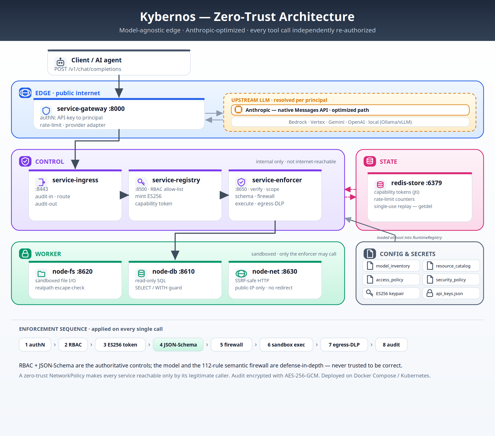
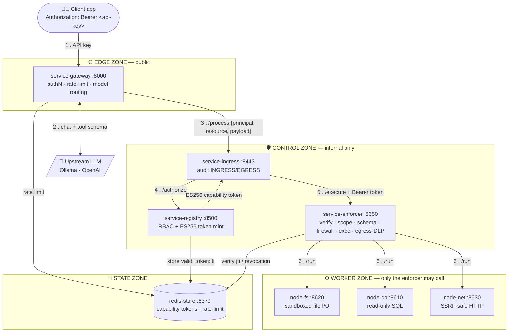
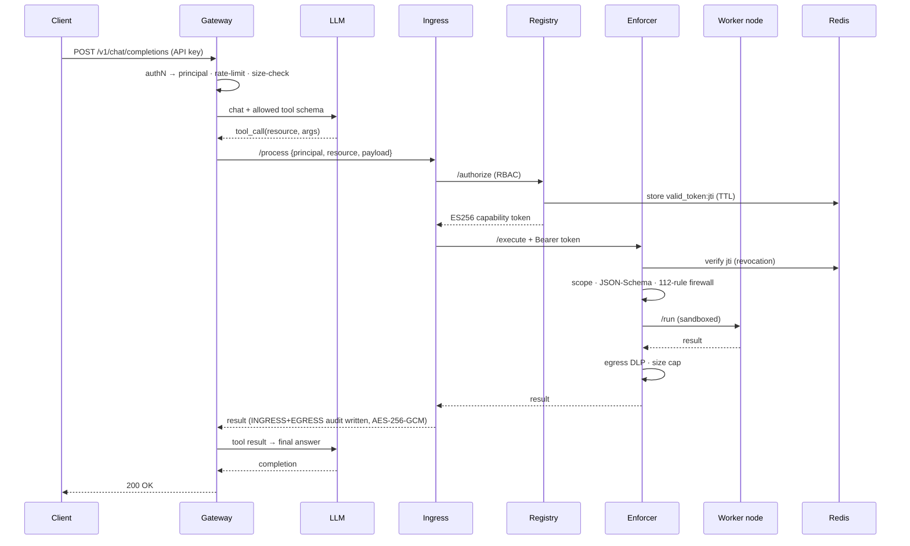
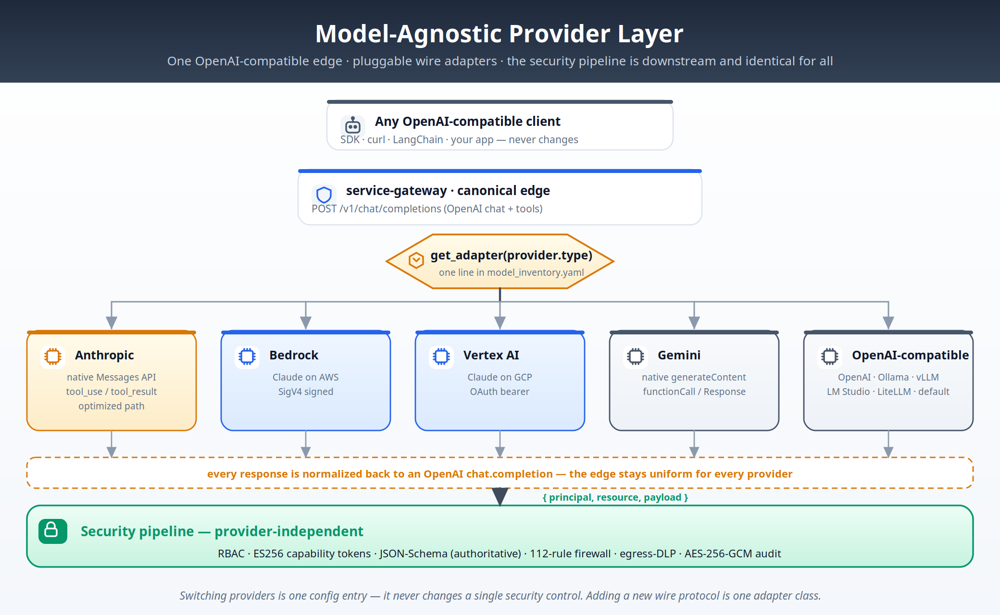
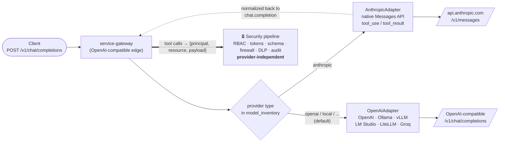
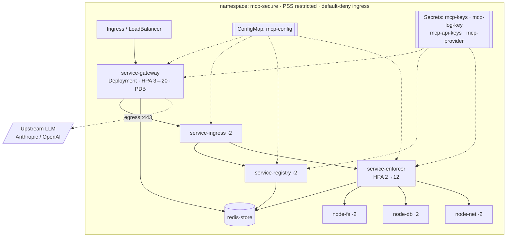
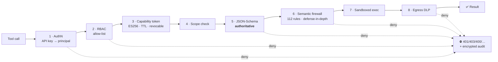

# 🛡️ Kybernos
### Zero-Trust Gateway for AI Agents · by Psypher Labs

**Put a NIST-aligned zero-trust firewall between your AI agents and the real world.**
Every tool call an LLM makes is authenticated, authorized, validated, filtered, sandboxed, and audited — *before anything runs.* Works with **any model** — Anthropic, OpenAI, Bedrock, Vertex, Gemini, or local.

*κυβερνήτης — the steersman for your AI agents.*


</div>

---

## Why this exists

LLMs and AI agents can now read files, run queries, and call APIs. That power is also the attack surface: **prompt injection is OWASP's #1 LLM risk two years running**, and a manipulated model is a manipulated *actor* holding real privileges. Most "AI firewalls" answer this with another opaque AI you're asked to trust blindly.

**Kybernos takes the opposite stance.** It applies decades-proven **Zero Trust Architecture (NIST SP 800-207)** to AI tool-calling: never trust the model, authenticate every identity, grant least-privilege access per call, validate everything deterministically, and audit it all. The AI is never the security boundary — **RBAC and schema validation are authoritative; the model and the pattern-firewall are not trusted to be correct.**

---

## What it is

A drop-in `POST /v1/chat/completions` endpoint that sits **in front of** your model. When the model emits a tool call, the gateway intercepts it and forces it through a chain of independent security services before any real tool executes:

```
authenticate → authorize → mint scoped capability token → validate → enforce → sandboxed execute → audit
```

| | |
|---|---|
| 🎯 **What it's for** | Safely giving LLM agents access to tools (filesystem, database, network, or your own) with enforceable least-privilege, in production. |
| 👤 **Who it's for** | Teams shipping agentic AI who need auditable, defensible controls — not a black box. |
| 🔌 **How you use it** | Point your app's OpenAI base URL at the gateway, pass an API key. Everything downstream is enforced automatically. |

---

## ✨ Key features

- 🧩 **Model-agnostic, Anthropic-optimized.** OpenAI-compatible edge; native adapter for Anthropic's Messages API plus a shared adapter for OpenAI / Ollama / vLLM / LM Studio / LiteLLM / any OpenAI-compatible server. Switching providers is a config entry and never touches the security controls.
- 🔐 **Identity from credentials, never from the request body.** Your API key maps to a *principal*; the model can't choose its own privileges.
- 🎫 **Per-call capability tokens.** Every tool call gets a fresh, scoped, short-lived **ES256-signed** token, tracked in Redis for replay protection and instant revocation.
- ✅ **Authoritative JSON-Schema validation.** Tool arguments are validated server-side against a strict schema — path traversal, non-`SELECT` SQL, and non-HTTPS URLs are structurally impossible.
- 🧱 **112-rule semantic firewall** (defense-in-depth) covering SQLi, RCE, LFI, SSRF, secret-leak/DLP, protocol attacks, and AI-jailbreak patterns.
- 🕵️ **Encrypted, tamper-evident audit.** Every request/response is logged with **AES-256-GCM** — a forensic chain of custody.
- 🏝️ **Sandboxed execution.** Tool executors run isolated, non-root, read-only-rootfs, with a hardened path-escape guard.
- ☸️ **Cloud-native & horizontally scalable.** Hardened Docker Compose and a full Kubernetes deployment with autoscaling and a real zero-trust `NetworkPolicy`.
- 🧪 **Proven, not asserted.** A **2,867-probe adversarial corpus** is verified against the real pipeline with ground-truth verdicts and **0 false-positives** on benign traffic.

---

## 🏗️ Architecture

The gateway is a mesh of **8 single-purpose services** across **4 trust zones**. Only the edge is public; a default-deny network policy lets each service talk *only* to its legitimate caller.

<p align="center"></p>

<details><summary>▸ interactive Mermaid version of the diagram above</summary>



</details>

### Trust zones

| Zone | Services | Responsibility | Public? |
|---|---|---|---|
| 🌐 **Edge** | `service-gateway` | Authentication, rate limiting, model routing, upstream LLM call | ✅ Only this |
| 🛡️ **Control** | `service-ingress`, `service-registry`, `service-enforcer` | Audit · authorization/RBAC · validation + firewall + execution dispatch | ❌ |
| ⚙️ **Worker** | `node-fs`, `node-db`, `node-net` | Sandboxed tool execution | ❌ |
| 💾 **State** | `redis-store` | Capability-token store + rate-limit counters | ❌ |

**Why split it up?** No single process both *authorizes* and *executes*. The registry decides *may this principal act*; the enforcer decides *is this call safe and well-formed*; the workers are the only code that touches real resources, and they're unreachable except from the enforcer. A compromise of any one zone cannot mint tokens, reach the workers, or read another zone's traffic.

### Request lifecycle (what happens on every tool call)



### 🧩 Model-agnostic provider layer

The edge is **always OpenAI-compatible**. A thin adapter (`src/common/providers.py`) translates to each backend's native wire format — and the security pipeline sits *downstream*, untouched by the choice of model.

<p align="center"></p>

<details><summary>▸ interactive Mermaid version of the diagram above</summary>



</details>

**Switching providers is a config entry and never changes a single security control.** Built-in adapters: **Anthropic** (native), **Bedrock** (Claude on AWS, SigV4), **Vertex** (Claude on GCP), **Gemini** (native), and **OpenAI-compatible** (OpenAI/Ollama/vLLM/LM Studio/LiteLLM/…). Adding another wire protocol is one adapter class.

---

## 🚀 Quick start (Docker)

**Prerequisites:** Docker + Docker Compose, and a model backend (a local [Ollama](https://ollama.com) with `mistral:7b-instruct`, or an OpenAI API key).

```bash
cd kybernos

# 1. Generate all secrets locally (ES256 keypair, audit key, API keys). Nothing is committed.
scripts/gen_keys.sh          # ← SAVE the API keys it prints, they're shown once

# 2. Launch the full 8-service mesh
docker compose -f deploy/docker/docker-compose.yml up --build

# 3. Health check
curl localhost:8000/healthz         # → {"status":"ok"}

# 4. Make an authenticated request (use the analyst key from step 1)
curl localhost:8000/v1/chat/completions \
  -H "X-API-Key: mcp_<your-analyst-key>" \
  -H "Content-Type: application/json" \
  -d '{"messages":[{"role":"user","content":"List the files in the sandbox."}]}'
```

Replay the verified security corpus against your running stack:

```bash
python scripts/probe_pipeline.py --base http://localhost:8443
```

### Run locally without Docker

Every service is a plain ASGI app, so you can run the whole stack with `uvicorn` — no containers. You just need a Redis (`docker run -p 6379:6379 redis:7-alpine`) and a model backend.

```bash
scripts/gen_keys.sh                       # ES256 keypair + API keys
scripts/run_local.sh                      # launches all 7 services on 127.0.0.1
# in another terminal — black-box smoke test against the running gateway:
scripts/smoke.sh                          # → smoke: 6 passed, 0 failed
```

`scripts/smoke.sh <base-url>` also works against a Docker/K8s deployment.

---

## ⚙️ Configuration in detail

All policy lives in `config/*.yaml`, loaded at boot. Secrets are **never** in config — they come from environment variables or mounted files. There are four policy files.

### 1. `config/access_policy.yaml` — who can do what (RBAC)

Maps each **principal** to the resources it may use. `admin: true` additionally unlocks the `/runtime/sbom` policy-disclosure endpoint.

```yaml
access_control_list:
  principal_analyst:                       # standard user
    allowed_resources: [resource_filesystem, resource_database]
  principal_auditor:                       # read-only
    allowed_resources: [resource_database]
  principal_netbot:                        # external calls only
    allowed_resources: [resource_network]
  principal_admin:                         # full access + admin endpoints
    admin: true
    allowed_resources: [resource_filesystem, resource_database, resource_network]
```

### 2. `config/model_inventory.yaml` — which LLM each principal uses (model-agnostic)

The gateway is **model-agnostic, optimized for Anthropic.** Its edge is always OpenAI-compatible; the provider `type` selects the wire adapter — `anthropic` uses the native Messages API (first-class path), and everything else is OpenAI-compatible (OpenAI, Ollama, vLLM, LM Studio, llama.cpp, LiteLLM, Together, Groq…). A principal can point at any provider; **every principal that calls the gateway must have a model entry**, or requests return `403`.

```yaml
providers:
  provider_anthropic:                      # recommended / optimized path
    type: "anthropic"
    endpoint: "https://api.anthropic.com/v1/messages"
    api_key_env: "ANTHROPIC_API_KEY"
    anthropic_version: "2023-06-01"
    max_tokens: 4096
  provider_openai:
    type: "openai"
    endpoint: "https://api.openai.com/v1/chat/completions"
    api_key_env: "REMOTE_API_KEY"
  provider_local:                          # Ollama / vLLM / LM Studio (OpenAI-compatible)
    type: "openai"
    endpoint: "http://host.docker.internal:11434/v1/chat/completions"
    api_key_env: "NULL_KEY"                # NULL_KEY = send no auth header
models:
  principal_analyst: { provider: provider_local,     upstream_model_id: "mistral:7b-instruct" }
  principal_admin:   { provider: provider_anthropic, upstream_model_id: "claude-opus-4-8" }
```

> **How it stays zero-trust across providers:** the provider adapter (`src/common/providers.py`) only translates the model wire format. RBAC, capability tokens, JSON-Schema validation, the firewall, egress DLP, and audit all run downstream on `{principal, resource, payload}` — **changing the model never changes the security controls.** Adding a new provider is a config entry (OpenAI-compatible) or one adapter class (`src/common/providers.py`).

### 3. `config/resource_catalog.yaml` — the tools and their contracts

Each resource declares its worker endpoint, a timeout, and a **JSON Schema** that is *enforced server-side* (`additionalProperties: false` rejects unexpected fields). The schema is the authoritative input control.

```yaml
resources:
  resource_filesystem:
    endpoint: "http://node-fs:8620"
    timeout: 5.0
    schema:                                 # enforced by the enforcer
      type: object
      additionalProperties: false
      required: [action, path]
      properties:
        action: { type: string, enum: [read, list, write] }
        path:   { type: string, pattern: "^(?!/)(?!.*\\.\\.)[a-zA-Z0-9_/.-]+(\\.txt|\\.json|\\.log|\\.md|/)?$" }
        content:{ type: string, maxLength: 10240 }
  resource_database:                        # SELECT/SHOW/DESCRIBE only
    endpoint: "http://node-db:8610"
    schema: { properties: { query: { pattern: "(?i)^(SELECT|SHOW|DESCRIBE)\\s+...\\s+FROM\\s+\\w+$" } } }
  resource_network:                         # HTTPS GET only, no internal IPs
    endpoint: "http://node-net:8630"
    schema: { properties: { url: { pattern: "^https://[a-zA-Z0-9.-]+..." }, method: { enum: [GET] } } }
```

### 4. `config/security_policy.yaml` — limits + the semantic firewall

System limits plus the **112-rule denylist** (defense-in-depth). Rules span 7 groups: **SQLI (29), RCE (28), LFI (20), DLP (14), FMT (8), SSRF (7), AI-jailbreak (6)**.

```yaml
system_limits:
  max_input_size: 524288        # 512 KB request body cap  → 413
  max_output_size: 4096         # 4 KB response cap (anti-exfil)
  token_ttl: 30                 # capability-token lifetime (seconds)
  max_requests_per_min: 10      # per-principal rate limit → 429
semantic_firewall:
  - { id: "SQLI_UNION", regex: "(?i)UNION\\s+(ALL\\s+)?SELECT", action: "BLOCK" }
  - { id: "SSRF_METADATA_AWS", regex: "(?i)169\\.254\\.169\\.254", action: "BLOCK" }
  # … 110 more
```

### Environment variables

| Variable | Used by | Default | Purpose |
|---|---|---|---|
| `CONFIG_PATH` | all | `/app/config` | Location of the policy YAMLs |
| `REDIS_URL` | gateway, registry, enforcer | `redis://redis_store:6379` | Token store + rate limiter |
| `AUTH_KEYS_JSON` / `AUTH_KEYS_PATH` | gateway | `/app/secrets/api_keys.json` | `api_key → principal` map |
| `PRIV_KEY_PATH` / `PUB_KEY_PATH` | registry / enforcer | `/app/keys/ecdsa_*.pem` | ES256 signing keypair |
| `LOG_ENC_KEY_HEX` | ingress, enforcer | — | AES-256-GCM audit-log key (hex) |
| `REMOTE_API_KEY` | gateway | — | Upstream cloud-provider key |
| `INGRESS_URL` / `REGISTRY_URL` / `ENFORCER_URL` | gateway / ingress | in-cluster DNS | Inter-service routing |
| `EGRESS_DLP` | enforcer | `true` | Scan tool *output* for secret leakage |
| `RATE_LIMIT_FAIL_CLOSED` | gateway | `false` | Deny if the rate limiter is unavailable |
| `UPSTREAM_TIMEOUT` | gateway | `120` | LLM call timeout (seconds) |
| `SANDBOX_DIR` | node-fs | `/app/data/sandbox` | Filesystem sandbox root |
| `LOG_LEVEL` | all | `INFO` | Log verbosity |

> 📖 Full key-by-key reference in the **[Developer Manual](DEVELOPER_MANUAL.md)** and **[User Manual](USER_MANUAL.md)**.

---

## 🔌 Using the API

The gateway is **OpenAI-compatible** — point any OpenAI client's base URL at it and pass your key.

```bash
# Filesystem (analyst): the model decides to call the tool; the gateway enforces it
curl localhost:8000/v1/chat/completions \
  -H "X-API-Key: $ANALYST_KEY" \
  -d '{"messages":[{"role":"user","content":"Read notes.txt from the sandbox"}]}'

# Database (auditor): only SELECT/SHOW/DESCRIBE survive schema validation
curl localhost:8000/v1/chat/completions \
  -H "X-API-Key: $AUDITOR_KEY" \
  -d '{"messages":[{"role":"user","content":"SELECT id FROM users"}]}'
```

A blocked attack returns a clear error — **that's the system working:**

```
400  {"detail":"Schema validation failed: '../../../etc/passwd' does not match pattern"}
400  {"detail":"Firewall Violation: SQLI_UNION"}
403  {"detail":"Authorization denied"}       # principal not permitted for this resource
429  {"detail":"Rate limit exceeded"}
```

---

## ☸️ Deploy on Kubernetes

Production-grade manifests under `deploy/k8s/`: PSS-`restricted` namespace, non-root pods with dropped capabilities and read-only rootfs, health probes, **HorizontalPodAutoscaler** (gateway 3→20, enforcer 2→12), PodDisruptionBudget, and a **zero-trust NetworkPolicy** (default-deny ingress + per-caller allows).

```bash
scripts/gen_keys.sh
docker build -f deploy/docker/Dockerfile -t mcp-universal:6.0 .
# load the image into your cluster, e.g.  kind load docker-image mcp-universal:6.0
deploy/k8s/apply.sh                              # namespace, ConfigMap, Secrets, workloads, HPA, NetworkPolicy
kubectl -n mcp-secure get pods -w
kubectl -n mcp-secure port-forward svc/service-gateway 8000:8000
```

### Cluster topology & zero-trust NetworkPolicy

Namespace `mcp-secure` runs under the **restricted** Pod Security Standard. The NetworkPolicy is **default-deny ingress**; each arrow below is the *only* traffic allowed to each service.



---

## 🧭 NIST SP 800-207 Zero-Trust alignment

This isn't zero-trust branding — it's a direct implementation of the tenets. A tool call must clear **every** gate below, in order, before it touches a resource (any gate can deny):



| NIST 800-207 tenet | How Kybernos implements it |
|---|---|
| **All resources are secured & modeled** | Tools are declared as first-class resources in `resource_catalog.yaml` with explicit contracts. |
| **Secure all comms regardless of network location** | Zero-trust `NetworkPolicy`: default-deny; each service reachable only by its caller. No implicit intra-cluster trust. |
| **Per-session access** | Every tool call mints a **fresh, scoped, short-lived** ES256 capability token — access is per-request, not standing. |
| **Access governed by dynamic policy** | RBAC allow-lists + JSON-Schema, evaluated live per call from policy-as-config. |
| **Authenticate & authorize *before* access** | No worker is reached until identity (API key→principal), authorization (RBAC), token validity, scope, and schema all pass. |
| **Monitor integrity & security posture** | Encrypted AES-256-GCM audit chain; a 2,867-probe corpus continuously verifies control efficacy. |
| **Collect data to improve posture** | Tamper-evident INGRESS/EGRESS logs feed threat-intel enrichment and rule refinement. |

Also mitigates **OWASP LLM Top 10** (LLM01 Prompt Injection, LLM02 Insecure Output Handling, LLM06 Excessive Agency, LLM07 Sensitive Info Disclosure) and aligns with the **NIST AI Risk Management Framework**.

---

## 🧪 Assurance — proven, not asserted

Six test suites plus a static gate, run in one command (`scripts/run_tests.sh`) and on every push via GitHub Actions:

| Suite | Assertions | What it proves |
|---|---|---|
| `test_providers.py` | **47** | All 5 adapters (Anthropic, Bedrock SigV4, Vertex, Gemini, OpenAI-compatible) translate correctly |
| `test_security_pipeline.py` | **27** | The real ZTA pipeline in-process (fakeredis + ASGI) — auth, RBAC, schema, firewall, sandbox, worker-error surfacing |
| `test_gateway_agnostic.py` | **6** | OpenAI + Anthropic paths route tool calls through the real pipeline |
| `test_e2e_full.py` | **17** | Full journey through the public edge: auth, limits, 3 provider paths, a blocked attack, RBAC denial, rate-limiting |
| `test_regressions.py` | **15** | Locks down every bug from the adversarial bug-hunt (SigV4, worker-error masking, single-use tokens, …) |
| `test_connectors.py` | **39** | Hostile inputs against `node-net`'s SSRF guard and `node-db`'s read-only SQL guard |

- ✅ **2,867 pipeline probes + 1,036 ATLAS-tagged prompt probes** across **30 attack categories**, each verdict established by replaying against the real pipeline — see [`tests/corpus/`](tests/corpus/).
- ✅ **0 false-positives** on the benign control group, every block attributed to the exact control (`rbac` / `schema` / `firewall:RULE`).

```bash
pip install -r requirements.txt -r requirements-dev.txt
scripts/gen_keys.sh          # ES256 keypair + local secrets
scripts/run_tests.sh         # → SUITE: 7 passed, 0 failed  (151 assertions)
```

---

## 📦 Project status

| Area | Status |
|---|---|
| Gateway, auth, RBAC, capability tokens, schema validation, firewall, audit | ✅ Implemented & verified |
| Docker + Kubernetes deployment, autoscaling, zero-trust networking | ✅ Implemented |
| `node-fs` sandboxed filesystem tool | ✅ Implemented |
| `node-db`, `node-net` worker nodes | ✅ Real connectors — `node-db` is a read-only SQL executor (SQLite/Postgres, single-SELECT guard, driver-enforced read-only), `node-net` is an SSRF-safe HTTPS egress fetcher (public-IP-only, no redirect-following). Remaining hardening is operational: a dedicated read-only DB grant and an IP-pinning egress proxy. |
| Auth backend | 🔑 API-key→principal (OIDC swap is a single-class change) |

> **Honest by design:** the semantic firewall is *defense-in-depth only* — RBAC + schema validation are the authoritative controls. See [`tests/corpus/TRIAGE.md`](tests/corpus/TRIAGE.md).

---

## 📚 Documentation

- **[User Manual](USER_MANUAL.md)** — installation, authentication, API usage, operations, FAQ.
- **[Developer Manual](DEVELOPER_MANUAL.md)** — architecture internals, configuration reference, security model, testing, extending, deployment.

---

## 📄 License

See [LICENSE](LICENSE).
